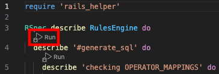
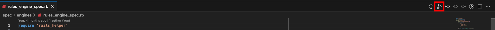

# Run RSpec
A VS Code Extension to run RSpec or just some RSpec blocks just with a click.

#### Requirements
1. Spec files should always end with `_spec.rb`.
2. The extension will only auto-run and show options on files ending with `_spec.rb`.

#### Usage
1. To run specific rspec blocks, just click on the `Run` button above the block

2. To run the entire rspec file, just click on the `Run` button on the Title Bar

#### Error, Issue Reporting and New Feature Requests
If you happen to run into any error, issues, or want to request some new features, please reach out to me via [me@soumit.in](mailto:me@soumit.in)

#### LICENSE
This extension is licensed under the [MIT License](LICENSE)

#### Enjoy !
